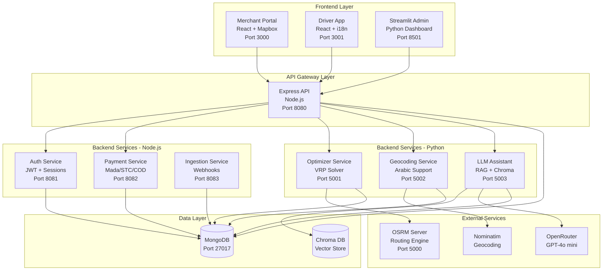
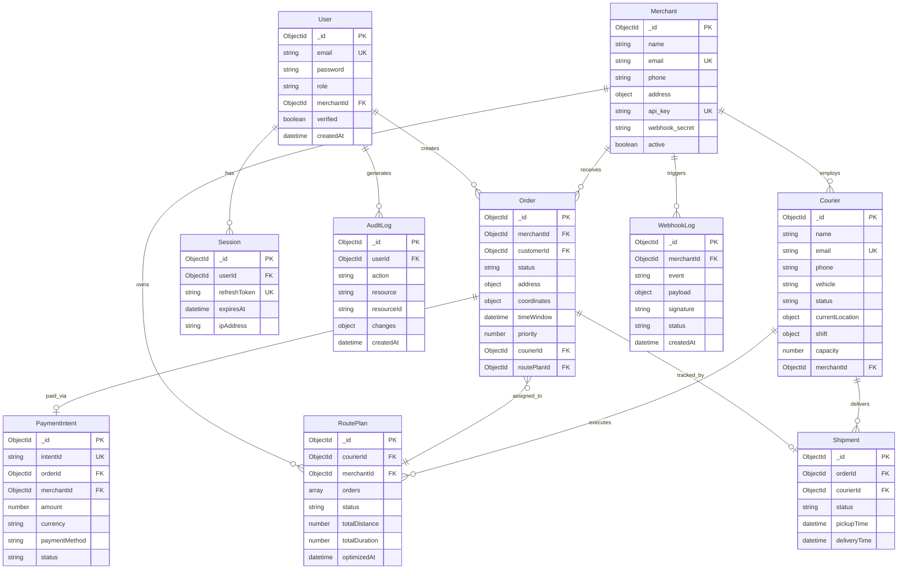
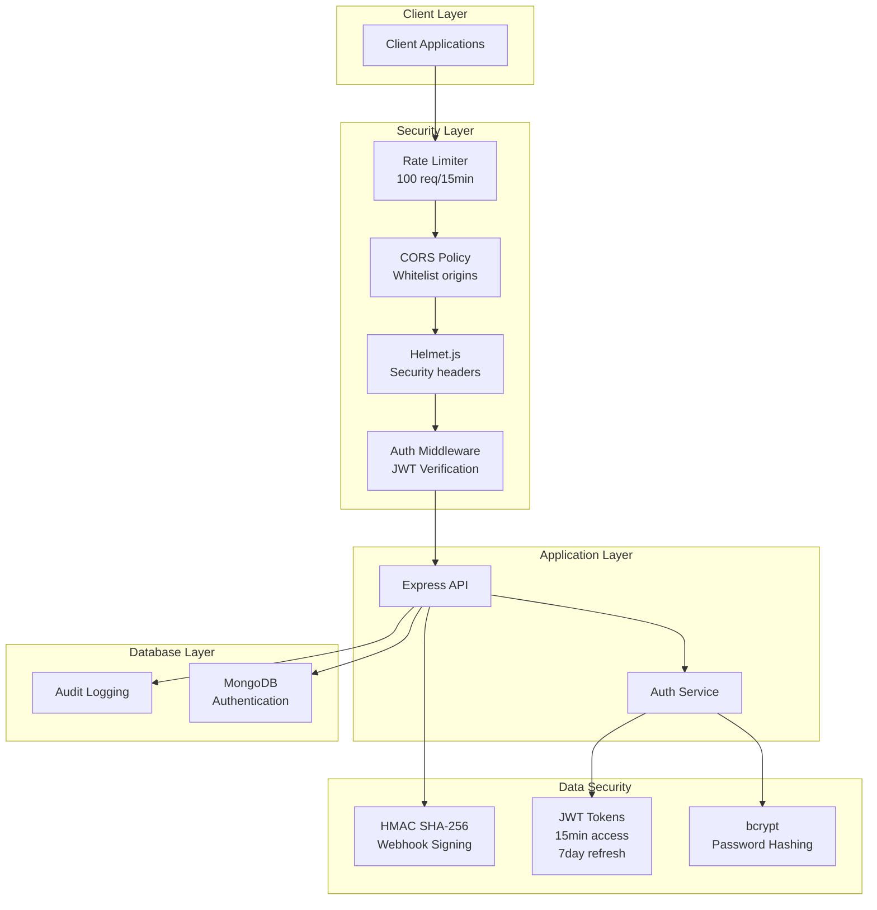
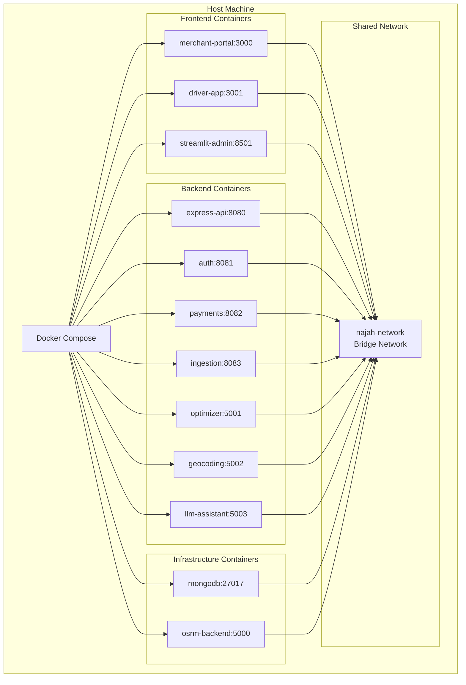
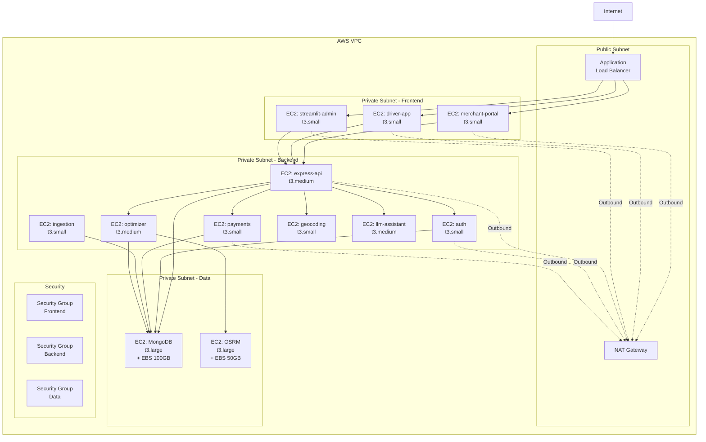

# System Architecture

## Overview

Najah Delivery OS is a comprehensive last-mile delivery optimization platform designed for the KSA market. The system uses a microservices architecture with 10 specialized services, MongoDB for data persistence, and integrates with external services like OSRM for routing and OpenRouter for LLM capabilities.

## High-Level Architecture



## Service Communication Flow

```mermaid
sequenceDiagram
    participant M as Merchant Portal
    participant EA as Express API
    participant AUTH as Auth Service
    participant GEO as Geocoding Service
    participant OPT as Optimizer Service
    participant DB as MongoDB
    participant OSRM as OSRM Server

    M->>EA: POST /api/orders (Arabic address)
    EA->>AUTH: Verify JWT token
    AUTH-->>EA: Token valid + user info
    EA->>GEO: Normalize & geocode address
    GEO-->>EA: Coordinates + normalized address
    EA->>DB: Store order with geo data
    DB-->>EA: Order created
    EA->>OPT: Trigger route optimization
    OPT->>DB: Fetch unassigned orders
    OPT->>OSRM: Calculate route matrix
    OSRM-->>OPT: Distance/duration matrix
    OPT->>DB: Save optimized route plan
    OPT-->>EA: Optimization complete
    EA-->>M: Order created response
```

## Component Descriptions

### Frontend Services

#### Merchant Portal (Port 3000)
- **Technology**: React 18, Vite, React Router
- **Purpose**: Web dashboard for merchants to manage orders, view deliveries, and track performance
- **Key Features**:
  - Order creation and management
  - Real-time delivery tracking with Mapbox
  - Bilingual UI (Arabic/English)
  - Merchant analytics dashboard
  - API key management

#### Driver App (Port 3001)
- **Technology**: React 18, Vite, React Router, i18next
- **Purpose**: Mobile-responsive app for couriers to view and execute delivery routes
- **Key Features**:
  - Route visualization with turn-by-turn navigation
  - Order status updates (picked up, in transit, delivered)
  - Real-time location sharing
  - Bilingual support for Arabic-speaking drivers
  - Offline-first design considerations

#### Streamlit Admin (Port 8501)
- **Technology**: Streamlit, Python, Pandas
- **Purpose**: Operations dashboard for administrators
- **Key Features**:
  - System health monitoring
  - User management
  - Order analytics and reporting
  - Courier performance metrics
  - Database inspection tools

### Backend Services - Node.js

#### Express API (Port 8080)
- **Technology**: Express.js, Mongoose, OpenAPI/Swagger
- **Purpose**: Main API gateway handling core business logic
- **Responsibilities**:
  - Order CRUD operations
  - Merchant management
  - Courier management
  - Route plan coordination
  - Tracking endpoints
  - LLM assistant proxy
- **Authentication**: JWT-based with refresh tokens
- **Rate Limiting**: 100 requests/15 minutes per IP
- **Middleware**: Helmet, CORS, request ID tracing

#### Auth Service (Port 8081)
- **Technology**: Express.js, bcrypt, JWT
- **Purpose**: Centralized authentication and authorization
- **Responsibilities**:
  - User registration and login
  - JWT access token generation (15 min expiry)
  - Refresh token management (7 day expiry)
  - Session management with TTL
  - Password hashing (bcrypt, 10 rounds)
  - Role-based access control (admin, merchant, driver, customer)

#### Payment Service (Port 8082)
- **Technology**: Express.js, Mongoose
- **Purpose**: Payment intent management for KSA payment methods
- **Responsibilities**:
  - Payment intent creation and confirmation
  - Support for Mada, STC Pay, Cash on Delivery
  - Payment status tracking
  - Webhook handling for payment providers
  - Idempotency for payment operations
- **Currency**: SAR (Saudi Riyal)

#### Ingestion Service (Port 8083)
- **Technology**: Express.js, crypto (HMAC)
- **Purpose**: Webhook receiver for external merchant integrations
- **Responsibilities**:
  - Receive order creation webhooks
  - HMAC signature verification
  - Webhook log persistence
  - Asynchronous order processing
  - Retry logic for failed webhooks

### Backend Services - Python

#### Optimizer Service (Port 5001)
- **Technology**: Flask, OR-Tools, OSRM client
- **Purpose**: Vehicle Routing Problem (VRP) solver with real-world routing
- **Responsibilities**:
  - Fetch unassigned orders from MongoDB
  - Group orders by merchant and time windows
  - Calculate distance/duration matrix via OSRM
  - Solve VRP with constraints (capacity, time windows, priorities)
  - Generate optimized route plans
  - Assign orders to couriers
- **Algorithm**: Google OR-Tools with guided local search
- **Constraints**: Vehicle capacity, delivery time windows, order priority

#### Geocoding Service (Port 5002)
- **Technology**: Flask, Nominatim, Arabic text processing
- **Purpose**: Address normalization and geocoding with Arabic support
- **Responsibilities**:
  - Normalize Arabic addresses (remove diacritics, standardize)
  - Geocode addresses to coordinates
  - Reverse geocoding (coordinates to address)
  - Bias results toward KSA
  - Handle both Arabic and English addresses
- **Provider**: Nominatim (OpenStreetMap)

#### LLM Assistant (Port 5003)
- **Technology**: FastAPI, LangChain, Chroma, OpenRouter
- **Purpose**: RAG-powered conversational assistant for delivery queries
- **Responsibilities**:
  - Answer questions about orders, routes, and system status
  - Retrieve relevant context from vector store
  - Generate natural language responses
  - Support Arabic and English queries
  - Provide fallback responses when no API key
- **Model**: GPT-4o mini via OpenRouter
- **Vector Store**: Chroma with embeddings
- **Documents**: System documentation, FAQs, operational procedures

## Data Architecture



### Geospatial Indexes

The system uses MongoDB's geospatial features for location-based queries:

- **Courier.currentLocation**: 2dsphere index for finding nearby couriers
- **Order.address.coordinates**: Compound index for proximity searches
- Used for courier assignment and delivery zone analysis

## Security Architecture



### Security Features

1. **Authentication**
   - JWT-based with short-lived access tokens (15 minutes)
   - Refresh tokens stored in secure HttpOnly cookies (7 days)
   - Password hashing with bcrypt (10 rounds)
   - Session management with automatic TTL cleanup

2. **Authorization**
   - Role-based access control (RBAC)
   - Roles: admin, merchant, driver, customer
   - Middleware-enforced permission checks

3. **Network Security**
   - Rate limiting per IP address
   - CORS with whitelist configuration
   - Helmet.js for security headers
   - Request ID tracing for audit

4. **Data Protection**
   - API keys hashed in database
   - Webhook secrets for HMAC verification
   - Environment variables for sensitive config
   - No plaintext passwords in logs

5. **PDPL Compliance (KSA)**
   - User consent tracking
   - Data minimization principles
   - Audit log for all data access
   - Right to access/delete user data

## Deployment Architecture

### Local Development (Docker Compose)



### AWS EC2 Deployment



**EC2 Instance Sizing:**
- Frontend (t3.small): 2 vCPU, 2GB RAM - ~$15/month
- Backend APIs (t3.small): 2 vCPU, 2GB RAM - ~$15/month
- Express API, Optimizer, LLM (t3.medium): 2 vCPU, 4GB RAM - ~$30/month
- MongoDB, OSRM (t3.large): 2 vCPU, 8GB RAM - ~$60/month
- **Total estimated cost**: ~$300-400/month

**Terraform managed:**
- VPC with public/private subnets
- EC2 instances with security groups
- Load balancer configuration
- EBS volumes for data persistence
- IAM roles and policies

## Technology Choices Rationale

### Microservices Architecture
**Chosen**: Microservices with service-specific responsibilities  
**Rationale**:
- Independent scaling of compute-intensive services (optimizer, geocoding)
- Technology diversity (Node.js for I/O, Python for algorithms)
- Fault isolation (payment failures don't affect tracking)
- Team autonomy and parallel development

### MongoDB
**Chosen**: MongoDB with Mongoose ODM  
**Rationale**:
- Geospatial indexing (2dsphere) for location queries
- Flexible schema for evolving address formats
- Strong Arabic text support (Unicode)
- Native JSON storage for nested documents (addresses, time windows)
- TTL indexes for session cleanup
- See [ADR-0002](adr/ADR-0002-database-choice.md)

### OSRM for Routing
**Chosen**: OSRM (Open Source Routing Machine)  
**Rationale**:
- Real-world routing on actual KSA road networks
- Fast distance/duration matrix calculation
- Free and self-hostable
- Active OSM KSA community maintaining road data
- See [ADR-0003](adr/ADR-0003-routing-engine.md)

### OR-Tools for VRP
**Chosen**: Google OR-Tools with guided local search  
**Rationale**:
- Production-grade VRP solver
- Supports constraints (capacity, time windows, priority)
- Fast optimization even with 50+ orders
- Free and open source

### React for Frontends
**Chosen**: React 18 with Vite  
**Rationale**:
- Component reusability across merchant/driver apps
- Large ecosystem (Mapbox, i18next, React Router)
- Fast hot-reload with Vite
- Strong TypeScript support (future migration)

### JWT Authentication
**Chosen**: JWT with refresh tokens  
**Rationale**:
- Stateless authentication scales horizontally
- Short access token expiry (15 min) limits exposure
- Refresh tokens enable session management
- Industry standard with library support

### Node.js for APIs
**Chosen**: Express.js with async/await  
**Rationale**:
- Non-blocking I/O for high concurrency
- Large middleware ecosystem (Helmet, CORS, rate limiting)
- Team familiarity
- Strong MongoDB integration via Mongoose

### Python for Algorithms
**Chosen**: Flask/FastAPI for services  
**Rationale**:
- OR-Tools and scientific libraries (NumPy, Pandas)
- LangChain/Chroma for LLM/RAG features
- Flask/FastAPI lightweight for microservices
- Strong typing with Pydantic

### Monorepo Structure
**Chosen**: Single repository with /services structure  
**Rationale**:
- Atomic commits across service boundaries
- Shared documentation and scripts
- Simplified CI/CD pipeline
- Single source of truth for infrastructure
- See [ADR-0001](adr/ADR-0001-monorepo.md)

### Docker Compose
**Chosen**: Docker Compose for local development  
**Rationale**:
- Reproducible environment across team
- Service networking and dependency management
- Easy health checks and service discovery
- HP Victus laptop compatible (8GB RAM)

### Terraform for AWS
**Chosen**: Terraform for infrastructure as code  
**Rationale**:
- Version-controlled infrastructure
- Reproducible deployments
- State management for changes
- AWS provider maturity

## Scalability Considerations

1. **Horizontal Scaling**
   - Stateless services can run multiple replicas
   - Load balancer distributes traffic
   - MongoDB replica set for HA

2. **Caching Strategy**
   - Redis for session storage (future)
   - Geocoding result caching
   - OSRM route caching

3. **Asynchronous Processing**
   - Message queue for webhook processing (future: RabbitMQ/Redis)
   - Background jobs for route optimization
   - Bulk order ingestion

4. **Database Optimization**
   - Compound indexes on frequent query patterns
   - TTL indexes for automatic cleanup
   - Connection pooling

## Monitoring & Health Checks

Each service exposes:
- `GET /health` - Basic health check
- `GET /health/ready` - Readiness check (DB connected)
- Structured JSON logs with request IDs
- Error tracking with stack traces

See [observability.md](observability.md) for details.

## Related Documentation

- [Data Models](data-models.md) - Detailed schema documentation
- [Security](security.md) - Security practices and PDPL compliance
- [Observability](observability.md) - Logging and monitoring
- [Runbook](runbook.md) - Operational procedures
- [ADR-0001: Monorepo](adr/ADR-0001-monorepo.md)
- [ADR-0002: Database Choice](adr/ADR-0002-database-choice.md)
- [ADR-0003: Routing Engine](adr/ADR-0003-routing-engine.md)
