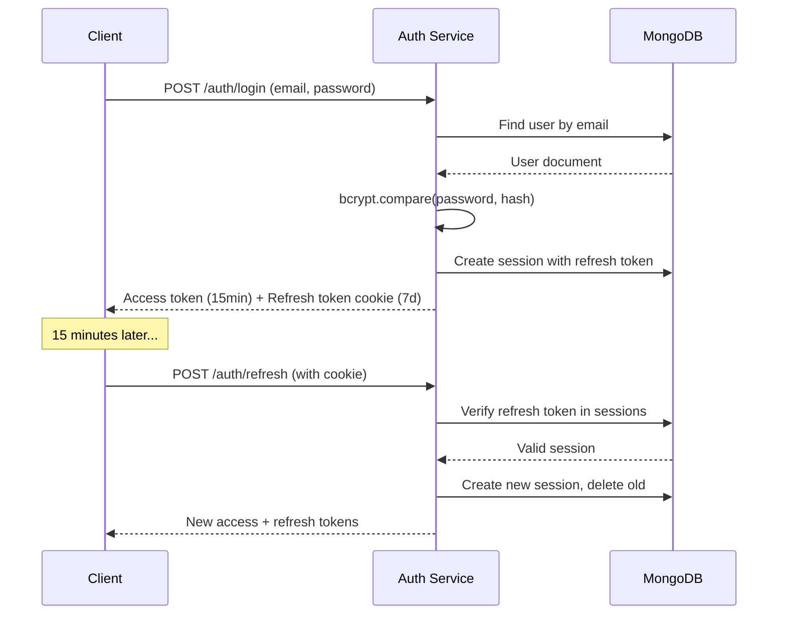

# Security & PDPL Compliance

This document outlines security practices, SSDLC implementation, and PDPL (Personal Data Protection Law) compliance for Najah Delivery OS.

## Table of Contents

- [SSDLC Practices](#ssdlc-practices)
- [Authentication & Authorization](#authentication--authorization)
- [Network Security](#network-security)
- [Data Protection](#data-protection)
- [PDPL Compliance (KSA)](#pdpl-compliance-ksa)
- [Audit Logging](#audit-logging)
- [Security Checklist](#security-checklist)

## SSDLC Practices

### Secure Development Lifecycle

**Phase 1: Requirements**
- Security requirements documented in ADRs
- Threat modeling for merchant API integration
- PDPL compliance requirements defined

**Phase 2: Design**
- Architecture review with security focus
- Data flow diagrams with trust boundaries
- Least privilege principle in service design

**Phase 3: Implementation**
- Secure coding guidelines (OWASP Top 10)
- Dependency vulnerability scanning (npm audit, pip-audit)
- Code review with security focus
- Static analysis (ESLint security plugins)

**Phase 4: Testing**
- Security test cases (authentication bypass, injection)
- Penetration testing on staging environment
- Automated security scanning in CI/CD

**Phase 5: Deployment**
- Infrastructure as Code (Terraform) review
- Secrets management (environment variables, AWS Secrets Manager)
- Security group configuration (least privilege)
- TLS/SSL certificate management

**Phase 6: Operations**
- Security monitoring and alerting
- Vulnerability patching SLA (critical: 24h, high: 7d)
- Incident response plan
- Regular security audits

## Authentication & Authorization

### JWT-Based Authentication

**Access Tokens**
- **Expiry**: 15 minutes
- **Algorithm**: HS256 (HMAC-SHA256)
- **Payload**:
  ```json
  {
    "userId": "507f1f77bcf86cd799439011",
    "email": "merchant@najah.sa",
    "role": "merchant",
    "merchantId": "507f1f77bcf86cd799439012",
    "iat": 1705401600,
    "exp": 1705402500
  }
  ```
- **Storage**: Memory only (never localStorage)

**Refresh Tokens**
- **Expiry**: 7 days
- **Storage**: Secure HttpOnly cookies
- **Rotation**: New refresh token issued on each use
- **Revocation**: Session table in MongoDB with TTL

**Token Flow**



### Role-Based Access Control (RBAC)

**Roles**:
- **admin**: Full system access, user management, system configuration
- **merchant**: Manage own orders, couriers, view analytics
- **driver**: View assigned routes, update delivery status
- **customer**: Create orders, track deliveries

**Authorization Middleware**

```javascript
// services/express-api/middleware/auth.js
function requireRole(...allowedRoles) {
  return (req, res, next) => {
    const userRole = req.user.role;
    
    if (!allowedRoles.includes(userRole)) {
      return res.status(403).json({
        error: 'Forbidden',
        message: 'Insufficient permissions'
      });
    }
    
    next();
  };
}

// Usage
router.get('/api/admin/users', 
  authenticateJWT, 
  requireRole('admin'), 
  listUsers
);
```

**Resource-Level Authorization**

Merchants can only access their own resources:

```javascript
// Before fetching order
const order = await Order.findById(orderId);

if (order.merchantId.toString() !== req.user.merchantId.toString()) {
  return res.status(403).json({ error: 'Access denied' });
}
```

### Password Security

**Hashing**
- **Algorithm**: bcrypt
- **Salt Rounds**: 10 (2^10 = 1024 iterations)
- **Pre-save Hook**: Automatic hashing on User model

```javascript
userSchema.pre('save', async function(next) {
  if (!this.isModified('password')) return next();
  
  const salt = await bcrypt.genSalt(10);
  this.password = await bcrypt.hash(this.password, salt);
  next();
});
```

**Password Requirements**
- Minimum length: 6 characters (enforce 8+ in production)
- Complexity: Mix of letters, numbers, symbols (recommended)
- No common passwords (implement password strength meter)

**Password Reset Flow**
1. User requests reset via email
2. Generate secure token (crypto.randomBytes(32))
3. Store token hash in database with 1-hour expiry
4. Send reset link via email
5. Verify token and allow password change
6. Invalidate token and all sessions

## Network Security

### Rate Limiting

**Express API Rate Limits**

```javascript
const rateLimit = require('express-rate-limit');

const limiter = rateLimit({
  windowMs: 15 * 60 * 1000, // 15 minutes
  max: 100, // 100 requests per window
  message: 'Too many requests from this IP',
  standardHeaders: true,
  legacyHeaders: false
});

app.use('/api/', limiter);

// Stricter limit for auth endpoints
const authLimiter = rateLimit({
  windowMs: 15 * 60 * 1000,
  max: 5, // 5 login attempts per 15 minutes
  skipSuccessfulRequests: true
});

app.use('/api/auth/login', authLimiter);
```

### CORS Configuration

**Allowed Origins**

```javascript
const cors = require('cors');

const corsOptions = {
  origin: function (origin, callback) {
    const allowedOrigins = [
      'http://localhost:3000',  // Merchant Portal
      'http://localhost:3001',  // Driver App
      'http://localhost:8501',  // Streamlit Admin
      'https://merchant.najah.sa',
      'https://driver.najah.sa',
      'https://admin.najah.sa'
    ];
    
    if (!origin || allowedOrigins.includes(origin)) {
      callback(null, true);
    } else {
      callback(new Error('Not allowed by CORS'));
    }
  },
  credentials: true, // Allow cookies
  maxAge: 86400 // Cache preflight for 24 hours
};

app.use(cors(corsOptions));
```

### Security Headers (Helmet)

```javascript
const helmet = require('helmet');

app.use(helmet({
  contentSecurityPolicy: {
    directives: {
      defaultSrc: ["'self'"],
      styleSrc: ["'self'", "'unsafe-inline'"], // For React inline styles
      scriptSrc: ["'self'"],
      imgSrc: ["'self'", "data:", "https:"],
      connectSrc: ["'self'", "https://api.mapbox.com"]
    }
  },
  hsts: {
    maxAge: 31536000, // 1 year
    includeSubDomains: true,
    preload: true
  },
  referrerPolicy: {
    policy: "strict-origin-when-cross-origin"
  }
}));
```

### Request ID Tracing

Every request gets a unique ID for tracing across services:

```javascript
const { v4: uuidv4 } = require('uuid');

app.use((req, res, next) => {
  req.id = req.headers['x-request-id'] || uuidv4();
  res.setHeader('X-Request-ID', req.id);
  next();
});

// Include in logs
logger.info('Order created', { 
  requestId: req.id, 
  orderId: order._id 
});
```

## Data Protection

### Data Classification

| Classification | Examples | Protection Level |
|----------------|----------|------------------|
| **Public** | Service status, API documentation | None |
| **Internal** | Order IDs, courier names | Authentication required |
| **Confidential** | Customer addresses, phone numbers | Authorization + encryption |
| **Restricted** | Passwords, API keys, payment data | Hashing/encryption + audit |

### Encryption

**At Rest**
- MongoDB: Enable encryption at rest (AWS EBS encryption)
- Backups: Encrypted before storage
- Logs: Mask sensitive fields (emails, phones)

**In Transit**
- TLS 1.2+ for all HTTP traffic
- HTTPS enforced in production
- Internal service communication over TLS (future)

**Application-Level Encryption**

```javascript
const crypto = require('crypto');

// Encrypt sensitive data (e.g., customer phone numbers)
function encrypt(text) {
  const algorithm = 'aes-256-gcm';
  const key = Buffer.from(process.env.ENCRYPTION_KEY, 'hex');
  const iv = crypto.randomBytes(16);
  
  const cipher = crypto.createCipheriv(algorithm, key, iv);
  let encrypted = cipher.update(text, 'utf8', 'hex');
  encrypted += cipher.final('hex');
  
  const authTag = cipher.getAuthTag();
  
  return {
    encrypted,
    iv: iv.toString('hex'),
    authTag: authTag.toString('hex')
  };
}
```

### Secrets Management

**Development**
- `.env` files (never committed to git)
- `.env.example` with placeholder values

**Production**
- AWS Secrets Manager or Parameter Store
- Environment variables injected at runtime
- Secrets rotation policy (API keys: 90 days)

**Secret Types**
- `JWT_SECRET`: Token signing key (256-bit random)
- `MONGODB_URI`: Database connection string
- `OPENROUTER_API_KEY`: LLM service key
- `ENCRYPTION_KEY`: Application-level encryption key
- Merchant `api_key`: Per-merchant API authentication
- Merchant `webhook_secret`: HMAC signature verification

### API Key Management

**Merchant API Keys**

```javascript
// Generation (on merchant creation)
const crypto = require('crypto');
const apiKey = crypto.randomBytes(32).toString('hex');
const webhookSecret = crypto.randomBytes(32).toString('hex');

// Storage (hashed)
const hashedApiKey = crypto
  .createHash('sha256')
  .update(apiKey)
  .digest('hex');

await Merchant.create({
  name: 'Merchant Name',
  api_key: hashedApiKey, // Store hash
  webhook_secret: webhookSecret
});

// Return plain key ONCE to merchant
return { api_key: apiKey };
```

**API Key Authentication**

```javascript
// Ingestion service webhook endpoint
async function verifyApiKey(req, res, next) {
  const apiKey = req.headers['x-api-key'];
  
  if (!apiKey) {
    return res.status(401).json({ error: 'API key required' });
  }
  
  const hashedKey = crypto.createHash('sha256')
    .update(apiKey)
    .digest('hex');
  
  const merchant = await Merchant.findOne({ 
    api_key: hashedKey,
    active: true 
  });
  
  if (!merchant) {
    return res.status(401).json({ error: 'Invalid API key' });
  }
  
  req.merchant = merchant;
  next();
}
```

### Webhook Security (HMAC)

**Signature Generation (Merchant → Najah)**

```javascript
const crypto = require('crypto');

function generateSignature(payload, secret) {
  return crypto
    .createHmac('sha256', secret)
    .update(JSON.stringify(payload))
    .digest('hex');
}

// Webhook request
const payload = { event: 'order.created', orderId: '...' };
const signature = generateSignature(payload, webhookSecret);

axios.post('https://api.najah.sa/webhooks', payload, {
  headers: {
    'X-Webhook-Signature': `sha256=${signature}`,
    'X-API-Key': apiKey
  }
});
```

**Signature Verification (Najah receives)**

```javascript
function verifyWebhookSignature(req, res, next) {
  const signature = req.headers['x-webhook-signature'];
  const merchant = req.merchant; // From API key verification
  
  const expectedSignature = crypto
    .createHmac('sha256', merchant.webhook_secret)
    .update(JSON.stringify(req.body))
    .digest('hex');
  
  const expected = `sha256=${expectedSignature}`;
  
  if (!crypto.timingSafeEqual(
    Buffer.from(signature), 
    Buffer.from(expected)
  )) {
    return res.status(401).json({ error: 'Invalid signature' });
  }
  
  next();
}
```

## PDPL Compliance (KSA)

The Personal Data Protection Law (PDPL) in Saudi Arabia requires specific data handling practices.

### Legal Basis for Processing

| Data Type | Legal Basis | Purpose |
|-----------|-------------|---------|
| Email, password | Consent | User authentication |
| Name, phone | Consent | Order delivery |
| Address, coordinates | Consent | Route planning and delivery |
| Payment info | Contractual necessity | Payment processing |
| IP address, user agent | Legitimate interest | Security and fraud prevention |
| Audit logs | Legal obligation | Compliance and investigation |

### Data Subject Rights

**Right to Access**
```javascript
// GET /api/users/:id/data
async function getUserData(req, res) {
  const userId = req.params.id;
  
  // Verify user can access their own data
  if (userId !== req.user.userId && req.user.role !== 'admin') {
    return res.status(403).json({ error: 'Access denied' });
  }
  
  const user = await User.findById(userId).select('-password');
  const orders = await Order.find({ customerId: userId });
  const sessions = await Session.find({ userId });
  const auditLogs = await AuditLog.find({ userId });
  
  res.json({
    user,
    orders,
    sessions: sessions.length,
    auditLogs: auditLogs.slice(0, 100) // Last 100 entries
  });
}
```

**Right to Deletion**
```javascript
// DELETE /api/users/:id
async function deleteUser(req, res) {
  const userId = req.params.id;
  
  // Soft delete (maintain order history for business purposes)
  await User.findByIdAndUpdate(userId, {
    email: `deleted_${Date.now()}@najah.sa`,
    password: 'DELETED',
    verified: false,
    deletedAt: new Date()
  });
  
  // Anonymize orders
  await Order.updateMany(
    { customerId: userId },
    { $unset: { customerId: "" } }
  );
  
  // Delete sessions
  await Session.deleteMany({ userId });
  
  // Log deletion
  await AuditLog.create({
    userId,
    action: 'user.delete',
    resource: 'user',
    resourceId: userId
  });
  
  res.json({ message: 'User data deleted' });
}
```

**Right to Rectification**
```javascript
// PATCH /api/users/:id
async function updateUser(req, res) {
  const { email, phone } = req.body;
  
  const user = await User.findByIdAndUpdate(
    req.params.id,
    { email, phone },
    { new: true }
  );
  
  // Log change
  await AuditLog.create({
    userId: req.user.userId,
    action: 'user.update',
    resource: 'user',
    resourceId: req.params.id,
    changes: { email, phone }
  });
  
  res.json(user);
}
```

### Consent Management

**Explicit Consent Collection**
```javascript
const userSchema = new mongoose.Schema({
  // ... other fields
  consents: {
    marketing: { type: Boolean, default: false },
    analytics: { type: Boolean, default: false },
    termsAccepted: { type: Boolean, required: true },
    privacyPolicyAccepted: { type: Boolean, required: true },
    consentDate: { type: Date, default: Date.now }
  }
});

// Registration requires consent
router.post('/register', async (req, res) => {
  if (!req.body.termsAccepted || !req.body.privacyPolicyAccepted) {
    return res.status(400).json({
      error: 'Terms and privacy policy acceptance required'
    });
  }
  
  // Create user...
});
```

### Data Minimization

Only collect and store necessary data:
- ✅ Customer address → Required for delivery
- ✅ Phone number → Required for contact
- ❌ Date of birth → Not needed
- ❌ Gender → Not needed
- ❌ Full payment card → Only last 4 digits

### Cross-Border Transfer

If data leaves KSA:
- Document transfers in privacy policy
- Ensure adequate protection (GDPR-equivalent)
- OpenRouter (US-based): Data processing agreement
- Mapbox (US-based): Geocoding only, no PII

## Audit Logging

### What to Log

**Authentication Events**
- Login success/failure
- Logout
- Token refresh
- Password change
- Account deletion

**Authorization Events**
- Access denied (403)
- Permission escalation attempts

**Data Access**
- Order creation, update, deletion
- Merchant data access
- Customer data access
- Export of personal data

**System Events**
- Configuration changes
- Service start/stop
- Database migrations

### Log Structure

```json
{
  "timestamp": "2024-01-16T08:30:00.000Z",
  "level": "info",
  "service": "express-api",
  "requestId": "a3f4b2c1-d5e6-f7g8-h9i0-j1k2l3m4n5o6",
  "userId": "507f1f77bcf86cd799439011",
  "action": "order.create",
  "resource": "order",
  "resourceId": "507f1f77bcf86cd799439013",
  "ipAddress": "203.0.113.42",
  "userAgent": "Mozilla/5.0...",
  "message": "Order created successfully"
}
```

### Log Retention

| Log Type | Retention | Storage |
|----------|-----------|---------|
| Application logs | 30 days | Disk, CloudWatch |
| Audit logs | 90 days | MongoDB, archived to S3 |
| Access logs | 7 days | Disk |
| Security events | 1 year | S3 Glacier |

### Log Protection

- Write-only access for applications
- Read access restricted to admin role
- Immutable logs (append-only)
- Integrity verification (hash chain for critical logs)

## Security Checklist

### Pre-Production

- [ ] All secrets in environment variables (no hardcoded)
- [ ] TLS/SSL certificates installed and valid
- [ ] HTTPS enforced (redirect HTTP → HTTPS)
- [ ] Rate limiting enabled on all endpoints
- [ ] CORS configured with whitelist
- [ ] Helmet security headers applied
- [ ] Authentication required for all non-public endpoints
- [ ] Authorization checks on resource access
- [ ] Input validation on all endpoints
- [ ] SQL/NoSQL injection prevention (parameterized queries)
- [ ] XSS prevention (sanitize HTML input)
- [ ] CSRF protection (SameSite cookies)
- [ ] Dependency vulnerability scan passed (npm audit, pip-audit)
- [ ] Secrets management solution configured
- [ ] Database backups enabled and tested
- [ ] Audit logging functional
- [ ] Error messages don't leak sensitive info
- [ ] Password policy enforced
- [ ] Session timeout configured
- [ ] API key rotation policy documented
- [ ] Incident response plan prepared

### Post-Production

- [ ] Monitoring and alerting configured
- [ ] Security logs reviewed weekly
- [ ] Vulnerability scanning scheduled (monthly)
- [ ] Penetration testing scheduled (quarterly)
- [ ] Security patches applied within SLA
- [ ] Access control reviewed quarterly
- [ ] Audit logs archived monthly
- [ ] Backup restoration tested quarterly
- [ ] Disaster recovery plan tested annually
- [ ] Security training for team (annually)

### Code Review Checklist

- [ ] No sensitive data in logs
- [ ] Authentication checked before data access
- [ ] Authorization enforced (user can only access their resources)
- [ ] Input validated and sanitized
- [ ] Error handling doesn't expose stack traces to client
- [ ] Passwords hashed with bcrypt
- [ ] SQL/NoSQL queries use parameterized format
- [ ] File uploads validated (type, size, content)
- [ ] Rate limiting on expensive operations
- [ ] Webhook signatures verified
- [ ] API keys never logged or exposed

## Incident Response

### Severity Levels

| Severity | Description | Response Time |
|----------|-------------|---------------|
| **Critical** | Data breach, system compromise | Immediate (1 hour) |
| **High** | Authentication bypass, privilege escalation | 4 hours |
| **Medium** | DoS, information disclosure | 24 hours |
| **Low** | Misconfiguration, minor vulnerability | 1 week |

### Response Steps

1. **Detection**: Automated alerts, log monitoring, user reports
2. **Triage**: Assess severity and impact
3. **Containment**: Isolate affected systems, rotate secrets
4. **Investigation**: Analyze logs, identify root cause
5. **Remediation**: Apply patches, fix vulnerabilities
6. **Recovery**: Restore normal operations, verify
7. **Post-Incident**: Document lessons learned, update procedures
8. **Notification**: Inform affected users if PDPL requires (72 hours)

### Contact

- **Security Team**: security@najah.sa
- **Data Protection Officer**: dpo@najah.sa
- **24/7 Hotline**: +966-XX-XXXXXXX

## Related Documentation

- [Architecture](architecture.md) - System design
- [Data Models](data-models.md) - Database schemas
- [Observability](observability.md) - Logging and monitoring
- [Runbook](runbook.md) - Operational procedures
